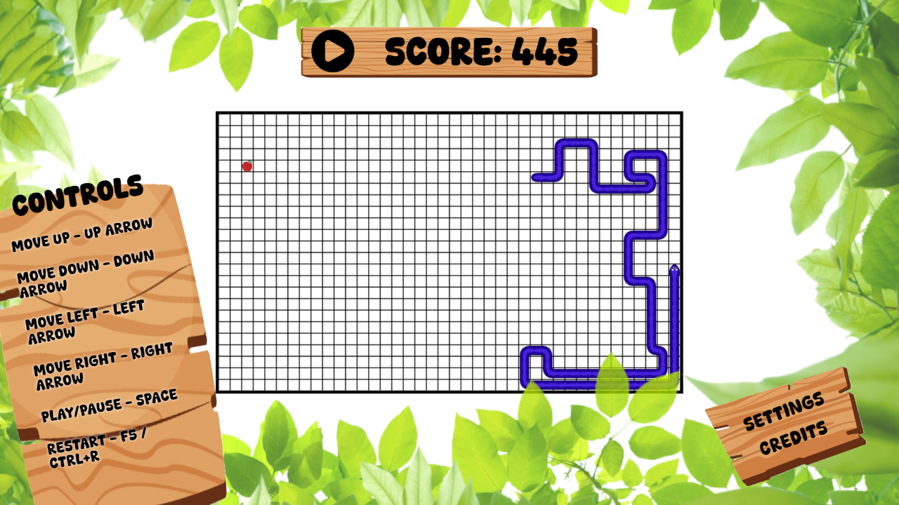

# Snake Game

A classic Snake game built using HTML5 Canvas and JavaScript. Control the snake using arrow keys to eat the food, grow longer, and try not to run into the walls or yourself!

Note: Looks best in 16:9 aspect ratio screens.

## Live Website

[Try it here](https://satzch.github.io/snake_game/)

## Installation

To get a local copy up and running, follow these simple steps.

1. **Clone the repo**

    ```bash
    git clone https://github.com/satzch/snake_game.git
    ```

2. **Open the `index.html` file**
   - You can open the file directly in a web browser.
   - Or go to the file in your file browser and double click to open it in your default browser or right click and select the desired browser to open with.

## Screenshot


Screenshot of game in full screen mode

## How to Play

- Use the arrow keys on your keyboard to move the snake.
- The goal is to eat the food, which makes the snake longer.
- Avoid running into the walls or your own tail, or the game will end.

## Features

- Classic snake gameplay
- Simple and intuitive controls
- Good Graphics
- Can be played both on Smartphone and Desktops

## Technologies Used

- HTML5 Canvas for rendering the game
- JavaScript for game logic

## Credits

- Wooden Board PNGs: [Designed by pch.vector] ([Freepik](http://www.freepik.com))
- Play/Pause Icon: ([Icons8](https://icons8.com))
- Background Leaves: ([Pngtree](https://pngtree.com/))
- Font: ([DaFont](https://www.dafont.com/))

All artwork and resources used in this project are free to use under the respective licenses provided by the creators.
